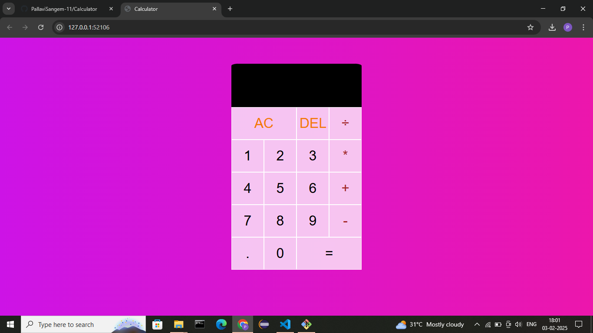

# Calculator Using Js
A simple JavaScript-based calculator that supports basic arithmetic operations. This app allows users to perform addition, subtraction, multiplication, and division with an easy-to-use interface.

## Features:
- **Basic Operations**: Addition (+), Subtraction (-), Multiplication (*), Division (÷)
- **Clear**: Resets the calculator.
- **Delete**: Deletes the last entered digit.
- **Decimal Support**: Allows entering decimal numbers.
- **Responsive Design**: Works well on different screen sizes.

## Preview:


## Technologies Used:
- **HTML**: For the structure of the calculator.
- **CSS**: For styling and layout.
- **JavaScript**: For functionality and logic.

## How It Works:
1. **Input Numbers**: Click on number buttons to enter digits.
2. **Select Operation**: Choose an operator (+, -, *, ÷).
3. **Compute**: Press the equals button (=) to compute the result.
4. **Clear**: Use the clear button (C) to reset the calculator.
5. **Delete**: Press the delete button (⌫) to remove the last digit entered.

## Installation:
1. Clone or download the repository to your local machine.
   ```bash
   git clone https://github.com/your-username/calculator-app.git
- Open the index.html file in a browser to use the calculator.
## Usage:
- Number buttons: Click to enter digits.
- Operation buttons: Click to choose operations.
- Equals button: Click to calculate the result.
- Clear button (C): Clears the current calculation.
- Delete button (⌫): Removes the last digit.
- Contributing:
- Fork the repository.
- Create a new branch.
- Make your changes and commit.
- Push to your fork and create a pull request.
## License:
- This project is open source and available under the MIT License.
